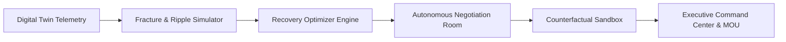

# Product Requirement Document (PRD)

## Project Name: NEXUS — Autonomous Self-Healing Supply Chain & Resilience Intelligence Platform
**Document Version:** 2.4.0  
**Status:** Approved & Implemented  
**Target Industry:** High-Tech Electronics Manufacturing & Global Enterprise Supply Chains  
**Reference Enterprise:** AURA Devices Inc. (Global High-Tech Electronics Manufacturer, ₹450 Cr ARR)  

---

## 1. Executive Summary & Vision

### 1.1 Problem Statement
Modern global supply chains operate in high-volatility environments plagued by single-source vulnerabilities, geopolitical friction, climate disruptions, and cascading second-order failures. Traditional supply chain management (SCM) and ERP systems are fundamentally **reactive**—they record disruptions after stockouts occur, leaving enterprises exposed to line-stopping penalties, soaring spot-market premiums, and irreversible revenue loss.

### 1.2 The NEXUS Solution
**NEXUS** is an enterprise-grade, **autonomous self-healing supply chain intelligence platform**. It pairs a high-fidelity digital twin with real-time multi-agent negotiation, ripple effect cascade forecasting, and multi-objective recovery optimization. NEXUS detects upstream fractures before they hit assembly hubs, simulates cascading failures across global tiers, synthesizes Pareto-optimal recovery pathways, and autonomously negotiates binding supplier term sheets in real-time.



---

## 2. Target User Personas & Role-Based Workflows

| Persona | Role | Primary Objective | Key Features Used |
| :--- | :--- | :--- | :--- |
| **Chief Supply Chain Officer (CSCO) / VP Supply Chain** | Strategic Global Oversight | Reduce Value-at-Risk (VaR), protect EBITDA, enforce multi-sourcing resilience. | Executive Command Center, Resilience Planner, Board Report Generator |
| **Plant Operations Director (Chennai / Austin / Penang)** | Manufacturing Hub Operations | Prevent assembly line-stops, maintain factory capacity utilization >85%. | Digital Twin Inspector, Fracture Mode Ripple Simulator, Stockout Runway Alarms |
| **Strategic Procurement & Sourcing Lead** | Supplier Commercial Relations | Secure alternative allocation, compress lead times, minimize rush surcharges. | Multi-Agent Autonomous Negotiation Room, Supplier Trust & Reliability Index Gauge |
| **Chief Financial Officer (CFO)** | Capital Allocation & Risk Management | Quantify financial exposure per minute, evaluate ROI on buffer investments. | Counterfactual "What-If" Sandbox, Live Value-at-Risk (VaR) Analytics |

---

## 3. Core Functional Modules & System Capabilities

### 3.1 Executive Command Center
* **Operational Risk Index (ORI):** Dynamic composite score (0–100) reflecting supply chain vulnerability, tier dependencies, and active fracture severity.
* **Financial Exposure & Value-at-Risk (VaR):** Real-time monitoring of at-risk revenue (e.g. ₹24.8 Cr at-risk), daily revenue burn rate (₹1.23 Cr/day), and recovery savings.
* **System Health Grid:** Real-time operational uptime across 15 interconnected hubs (East Asia, Europe, North America, South Asia).
* **Active Fracture Alerts:** Real-time priority notifications displaying affected components, stockout countdown timers, and recommended playbooks.

### 3.2 Multi-Tier Supply Chain Digital Twin
* **Interactive Hybrid Visualizations:** Dual-mode visualization supporting:
  * **Topological Graph View:** Force-directed node-link visualizer mapping dependencies from Tier-2 suppliers ➔ Tier-1 component makers ➔ Assembly Plants ➔ Distribution Hubs ➔ Enterprise Clients.
  * **Geospatial Mercator World Map:** D3/TopoJSON global map with interactive location plotting and great-circle shipping lanes.
* **Real-Time Node Telemetry Inspector:**
  * Node type categorization, capacity units/month, operational load bar, lead time days, baseline unit cost, and stockout runway.
  * **Simulate Fracture Action:** Instant trigger button at the top of the inspector pane to test disruptions on any selected node.
* **Supplier Trust Score & Reliability Index:**
  * Semicircular meter gauge with dynamic color gradient (`#ff7a1a` ➔ `#f59e0b` ➔ `#10b981`).
  * Historical consignment volume tracking (e.g. 1,420 batches delivered for TSMC Partner).
  * On-time fulfillment SLA percentages (e.g. 99.4% On-Time) and ISO/IATF compliance certifications.

### 3.3 Autonomous Fracture Mode & Ripple Effect Simulator
* **Disruption Archetypes:** Pre-configured stress scenarios:
  1. *Geopolitical Blockade:* Malacca Strait shipping chokehold & East Asia export bans.
  2. *Extreme Weather:* Super Typhoon shutting down coastal air and ocean freight.
  3. *Cybersecurity / ERP Outage:* Ransomware lock on global logistics EDI networks.
  4. *Tier-1 Foundry Insolvency:* Sudden operational cessation of primary silicon supplier.
* **Cascade Propagation Engine:** Recursive graph traversal modeling first-order, second-order, and terminal downstream impacts.
* **Real-Time Exposure Counters:**
  * Financial burn rate (₹/minute and ₹/day).
  * Projected factory shutdown timeline (e.g. *Chennai Line-Stop in 4.2 Days*).
  * Buffer inventory depletion tracking per SKU.

### 3.4 Self-Healing Recovery Cockpit
* **Multi-Objective Pareto Recovery Optimization:** Algorithmically evaluates trade-offs across capital cost, recovery speed, carbon footprint, and operational confidence.
* **Strategic Recovery Playbooks:**
  * **Speed-First Strategy:** Express airlift charter, spot-market allocation, 3-day recovery, higher cost premium.
  * **Cost-Optimized Strategy:** Multimodal ocean-rail rerouting, secondary supplier ramping, 8-day recovery, lowest capital cost.
  * **Balanced Resilience Strategy:** Dual-lane split dispatch, 4-day recovery, optimal risk-adjusted ROI.
* **Execution Actions:** One-click transition to Autonomous Negotiation Room with auto-populated parameters.

### 3.5 Multi-Agent Autonomous Negotiation Room
* **Autonomous Multi-Round Dialogue Engine:**
  * Turn-based negotiation between NEXUS Autonomous Procurement Agent and global supplier representatives (Sarah Jenkins / Apex Silicon USA, Kenji Sato / Kyoto Micro Japan, Dr. Elena Weber / Bavaria Sensorik Germany, Dr. Morris Lin / Taiwan Micro Foundry, Min-Jun Park / Han River Memory Korea).
  * Counter-proposals with dynamic incentives (volume commitments, payment acceleration, multi-plant preferred vendor agreements).
* **Human-in-the-Loop Decision Gates:**
  * 🟢 **Approve:** Locks agreed commercial terms and triggers "Consensus Finalised" event.
  * 🔴 **Disagree / Disapprove:** Rejects terms, prompts "Strategy Disapproved", and allows alternative directive injection.
  * 🟠 **Negotiate Further:** Prompts autonomous agent to leverage deeper concessions (rush fee waivers, extended warranties, consignment stock).
* **Enlarged Supplier Reliability Index Pane:**
  * Right-side inspector featuring an enlarged semicircular trust score gauge, historical consignment metrics, and live before-and-after concession comparisons.
* **Binding Legal Term Sheet & MOU Generator:**
  * Generates digital term sheet with cryptographic contract reference, penalty waiver clauses, and binding electronic sign-off.

### 3.6 Counterfactual "What-If" Sandbox Engine
* **Scenario Modeling:** Allows planners to test strategic resilience investments:
  * Strategic safety stock buffer increases (+15 to +45 days).
  * Dual-sourcing supplier qualification.
  * Regional buffer hubs (Singapore / Dubai / Rotterdam).
* **Side-by-Side Impact Matrix:** Real-time delta comparison showing Capex Investment vs Expected Value-at-Risk reduction vs 3-Year ROI.

### 3.7 Executive Board Briefing & Report Generator
* Full-screen interactive modal synthesizing the entire incident post-mortem, financial impact breakdown, negotiated commercial concessions, and long-term resilience roadmap.

---

## 4. Technical Architecture & System Specifications

```
+-----------------------------------------------------------------------------------+
|                                 CLIENT TIER (React 18)                            |
|  +-----------------------------------------------------------------------------+  |
|  |  Views: Command Center | Digital Twin | Fracture Simulator | Recovery       |  |
|  |         Negotiation Room | Counterfactual Sandbox | Persona Matrix          |  |
|  +-----------------------------------------------------------------------------+  |
|  |  UI/Design System: Vanilla CSS + Tailwind CSS + Glassmorphism (Extej Theme) |  |
|  |  Visual Engines: D3-Geo (Cartographic) + SVG Topology Canvas + Recharts     |  |
|  +-----------------------------------------------------------------------------+  |
|  |  Interactive Physics Canvas: Dynamic Cursor-Reactive Micro-Dot Background   |  |
+-----------------------------------------------------------------------------------+
                                         |
                                         | REST / JSON APIs
                                         v
+-----------------------------------------------------------------------------------+
|                                SERVER TIER (Node.js + Express)                    |
|  +-----------------------------------------------------------------------------+  |
|  |  Controllers: Network | Simulation | Recovery | Negotiation | Resilience    |  |
|  +-----------------------------------------------------------------------------+  |
|  |  Engines:                                                                   |  |
|  |    * Ripple Propagation Graph Traversal Engine                              |  |
|  |    * Pareto Multi-Objective Optimization Solver                             |  |
|  |    * Multi-Agent Dialogue & Concession Engine                               |  |
|  |    * Value-at-Risk & ORI Calculator                                         |  |
+-----------------------------------------------------------------------------------+
                                         |
                                         v
+-----------------------------------------------------------------------------------+
|                                 DATA & PERSISTENCE TIER                           |
|  +-----------------------------------------------------------------------------+  |
|  |  Database: SQLite (nexus.db) + Synthetic High-Tech Telemetry Dataset        |  |
|  |  Schemas: Nodes, Edges, Disruptions, Playbooks, Suppliers, TermSheets       |  |
+-----------------------------------------------------------------------------------+
```

---

## 5. UI/UX Design System & Interactive Standards

* **Design Aesthetic:** Extej Executive Glassmorphism with deep slate background (`#f4f6fa`), crisp white card elevation with subtle borders (`border-slate-200/80`), and vibrant micro-gradients.
* **Palette:**
  * Primary Accent: Brand Orange (`#FF6B00`, `#ff7a1a`, `#ea580c`)
  * Primary Action / Workflow Transition: Pill Purple (`#6B00D7`, `btn-purple-pill`)
  * Severity Colors: Fractured/Disrupted (`#e11d48`), Impaired (`#f59e0b`), Optimal (`#10b981`)
* **Background Physics:** Dynamic interactive canvas with small orange (`rgba(255, 107, 0, 0.80)`) and slate (`rgba(15, 23, 42, 0.65)`) micro-dots with mouse repel/attract mechanics.
* **Header Density:** Ultra-compact `px-4 py-2.5` banners across all views to ensure maximum viewport visibility for interactive work areas and zero vertical scrolling overhead.

---

## 6. Verification & Validation Metrics

| Quality Attribute | Target Specification | Validated Result |
| :--- | :--- | :--- |
| **Frontend Build Compilation** | Zero syntax errors, zero unresolved imports via Vite | **PASS** (1.53s production build) |
| **Negotiation Response Latency** | Instant turn execution / auto-play < 600ms per round | **PASS** |
| **Graph & Map Interactivity** | 60 FPS smooth pan, zoom, click-to-focus | **PASS** |
| **Viewport Ergonomics** | MOU button & decision notifications fully visible without scrolling | **PASS** |

---

## 7. Deliverables & Repository Assets

* **Live Source Codebase:** Complete React + Express application in `/Users/prathamagnihotri/IDE/Hackathons/SAP_2026/Nexus`.
* **Synchronized ZIP Package:** `/Users/prathamagnihotri/IDE/Hackathons/SAP_2026/Nexus.zip`.
* **GitHub Repository:** [https://github.com/Pratham-Agnihotri/nexus-resilience-platform.git](https://github.com/Pratham-Agnihotri/nexus-resilience-platform.git) on branch `main`.
